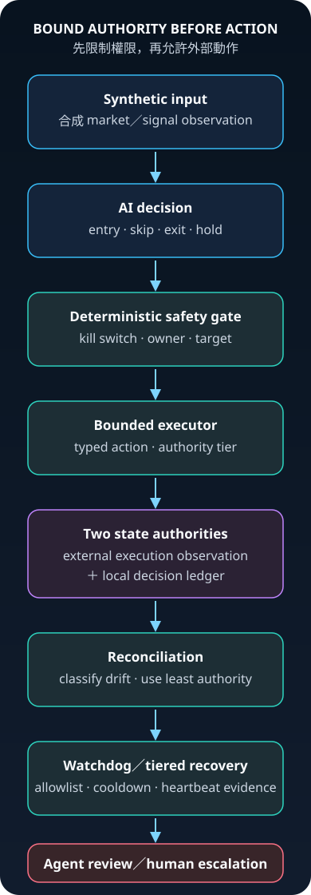

[繁體中文](README.zh-TW.md)

# ORINX

**Agentic Trading Operations Under External Side Effects**

> When the agent and the exchange disagree, the system must know which state is allowed to authorize the next action.

Created and operated by Titus Lai.

During long-running operation, ORINX monitored markets, made entry and exit decisions, and managed
execution without constant screen-watching. It paired AI-driven judgment with deterministic kill switches,
exchange／local state reconciliation, tiered recovery authority, and human escalation boundaries.

Real operating failures—exchange／local drift, incomplete exits, silent scheduler death, and ownership
conflicts—forced it to evolve from an AI trading assistant into an operating system with explicit limits
on what the agent could observe, retry, repair, or escalate.

## The incident that changed the architecture

### Before

The local ledger and exchange both reported the same system-owned open position. One decision, one
lifecycle, and two aligned observations made exposure appear unambiguous.

### Failure

A partial close committed on only one side: the local ledger recorded `closed`, while the exchange still
reported `open`. The agent's own state now said there was no exposure even though the external venue still
carried it.

### Decision

ORINX stopped treating either copy as universal truth. It preserved both observations, classified
`exit_not_committed`, checked ownership and kill-switch authority, and refused to manufacture a successful
sync by rewriting one state to match the other.

### Permanent fix

A system-owned transient exit may receive at most one bounded retry. The system then re-observes both
authorities; unresolved, ambiguous, manual-owned, or kill-switched states cross the human boundary with
typed evidence.


[Read the full incident reconstruction](docs/when-agent-and-exchange-disagree.md).

This repository is a clean-room technical case. It does not contain the original product source or any
live execution connection. The code here uses synthetic observations to make two operating decisions
inspectable: what happens when two state authorities disagree, and who is allowed to repair each failure.



## What this repository proves

- **Authority remains explicit.** AI decisions do not erase kill-switch, ownership, or mutation boundaries.
- **Drift becomes a typed incident.** Exchange-only, local-only, direction-, lifecycle-, and incomplete-exit
  states produce different findings instead of one generic sync response.
- **Recovery is tiered.** Low-risk, allowlisted actions and current, same-lifecycle local settlement may run
  automatically; ambiguous or high-risk durable mutations escalate to an agent or human.
- **Evidence is offline.** Every public scenario is deterministic, synthetic, and testable without an
  exchange, network, credential, database, or paid service.

## Two cases

### 1. When the Agent and the Exchange Disagree

An external execution venue and a local decision ledger can diverge after a partial failure. The
reconciliation demo classifies the disagreement, checks ownership, applies kill-switch precedence, and
returns the least-authoritative safe action.

[Read the case](docs/when-agent-and-exchange-disagree.md) ·
[Inspect the engine](demo/reconciliation/engine.py) ·
[Inspect the tests](tests/test_reconciliation.py)

### 2. Who Is Allowed to Fix What?

A watchdog that detects a failure still needs a policy for what it may change. The authority demo
separates ephemeral repair, one bounded restart, agent review, human escalation, notification cooldown,
and the external-heartbeat evidence needed to avoid a false healthy state.

[Read the case](docs/who-is-allowed-to-fix-what.md) ·
[Inspect the engine](demo/watchdog_authority/engine.py) ·
[Inspect the tests](tests/test_watchdog_authority.py)

## Run the evidence

Python 3.11 or later is the only requirement.

```bash
python3 -m unittest discover -s tests -v
python3 -m demo.reconciliation.example
python3 -m demo.watchdog_authority.example
```

The examples use fixed timestamps and `SYNTH-*` instruments. They read no environment variables or files
and make no network calls.

## Architecture and evolution

- [Architecture and evidence map](docs/architecture.md)
- [Project evolution](docs/evolution.md)
- [Reconciliation state machine](assets/reconciliation-state-machine.svg)
- [Synthetic partial-failure timeline](assets/failure-timeline.svg)

## Public boundary

The public mechanisms were independently rewritten from behavior contracts and synthetic fixtures. The
original runtime remains private. Historical failure classes inform the cases, but their identifying
details do not appear here.

## Intentionally excluded

- live accounts, positions, orders, identifiers, and execution endpoints;
- private strategies, parameters, prompts, memory, journals, and runtime data;
- product deployment topology and operational commands;
- trading outcomes or claims about a currently running system.

This repository demonstrates engineering judgment around external side effects. It is not investment
advice and is not intended for real-money execution.
