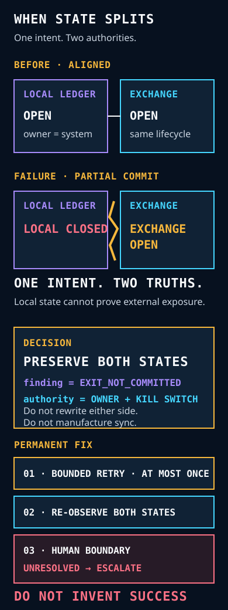
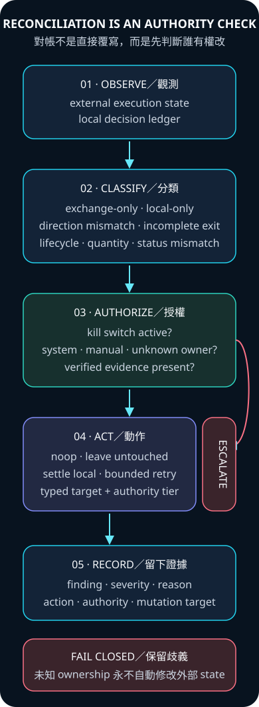

[English](when-agent-and-exchange-disagree.md)

# 當 Agent 與交易所互相矛盾

## 事故重建

### 出事前

Local ledger 與 exchange 都回報同一個 system-owned open position，且 lifecycle 相同。

### 故障

一次 partial close 讓 local ledger 成為 `closed`，exchange position 卻仍是 `open`。Agent 已無法從
自己的 state 推論外部 exposure。

### 決策

同時保存兩份 observation、分類 `exit_not_committed`、釐清 ownership，並在批准任何 mutation
前套用 kill-switch precedence。不得靠改寫任一 record 來製造一致。

### 永久修復

已確認的 transient failure 最多 bounded retry 一次；之後重新觀測兩份 authority，任何仍未解決
或有歧義的 state，都必須帶著 typed evidence 跨過 human boundary。



## 問題

External execution 與 local state 不會 atomic commit。Close request 可能已抵達外部場所，但本機
write 失敗；local record 也可能已關閉，外部 position 卻仍開著；或人類建立了一個 agent 從未
擁有的 position。若把所有 mismatch 都當成「同步後繼續」，可能造成重複 exposure，甚至改到
不屬於系統的 position。

真正困難的問題不是哪一份資料永遠正確，而是：針對下一個具體動作，哪一份 observation 才是
權威？系統是否擁有即將被改動的 state？



## 設計決策

ORINX 將 observation、classification、authorization 與 mutation 分開：

1. External 與 local observations 各自保留。
2. 提出 repair 前先分類 disagreement。
3. 任何 external mutation 前先釐清 ownership。
4. Kill switch 具有最高優先權。
5. 只選擇權限最小且仍安全的動作。
6. 有歧義時升級，不製造不存在的確定性。

Clean-room engine 只回傳 typed finding 與 typed action，不直接執行 side effect。第二層 guard 會
拒絕任何 automatic account／database mutation、kill switch 啟用時的 exchange mutation，以及
manual／unknown ownership 的 exchange mutation。

## 五類 failure class

### Exchange-only

External observation 有 position，但 local ledger 沒有對應紀錄。

- **Manual ownership：** 保持不動。
- **Unknown ownership：** 通知人類；不能因為 local absence 就推定 ownership。
- **System ownership：** 視為 orphan incident，要求明確 review。

證據：[`test_manual_exchange_position_is_never_mutated`](../tests/test_reconciliation.py) 與
[`test_unknown_exchange_owner_fails_closed_to_human`](../tests/test_reconciliation.py)。

### Local-only

Local ledger 有 open record，但 external observations 中不存在。只有另一份獨立、已驗證、
屬於同一 position lifecycle 且位於目前 observation window 的 synthetic close record，才允許
local settlement；stale、future、prior-lifecycle 或缺少證據都必須升級。

證據：[`test_verified_local_only_position_can_settle_local_ledger`](../tests/test_reconciliation.py)、
[`test_stale_close_evidence_cannot_settle_a_reopened_local_position`](../tests/test_reconciliation.py) 與
[`test_close_evidence_from_a_prior_position_lifecycle_is_rejected`](../tests/test_reconciliation.py)。

### Direction mismatch

兩個系統指向同一 instrument，卻對 position side 意見相反。Demo 會在用完整 position key 配對前
先分類這個矛盾，避免把一個 contradiction 錯拆成兩個 unrelated missing records。此狀態禁止
automatic repair。

證據：[`test_direction_mismatch_never_autofixes`](../tests/test_reconciliation.py)。

### Lifecycle mismatch

Instrument、side、quantity 與 status 相同，仍不能證明兩份 observation 指向同一個 position instance。
只要 lifecycle identity 不同，engine 就回傳 critical typed finding 並要求 human review，不會誤報
`aligned`。

證據：[`test_different_position_lifecycles_never_report_aligned`](../tests/test_reconciliation.py)。

### Incomplete exit

Local record 已 closed，但 external state 仍 open。只有 system-owned position、有已記錄的 transient
failure，且 kill switch 關閉時，才允許一次 retry；其他形狀一律升級。

證據：[`test_transient_system_exit_failure_retries_once_when_enabled`](../tests/test_reconciliation.py) 與
[`test_kill_switch_blocks_retry_exchange_close`](../tests/test_reconciliation.py)。

### Guard states：status mismatch 與 ambiguous observations

Engine 也不會把相反的 open／closed status 誤判為 aligned，或把多筆 observations 錯標成 quantity
error。兩種狀態都有自己的 finding，並要求 human review。

證據：[`test_closed_exchange_and_open_local_is_state_mismatch`](../tests/test_reconciliation.py) 與
[`test_duplicate_observations_are_ambiguous_not_quantity_mismatch`](../tests/test_reconciliation.py)。

## 為什麼 mutation order 很重要

Engine 刻意區分「觀察到 mismatch」與「修復 mismatch」。先改 local ledger，不能讓 external
action 自動變安全；external position 不存在，也不能單獨證明 local settlement 合理。每一次
mutation 都需要自己的 evidence 與 authority。

## Trade-off

Fail closed 會讓部分 incident 更久才能解決，也增加 human review；這是明確的 availability cost。
但另一條路——自動關閉 manual position、在 kill switch 下繼續 retry，或沒有證據就把 local
state 標成 closed——會製造更大、也更難逆轉的 failure。

## 離線檢查

```bash
python3 -m unittest tests.test_reconciliation -v
python3 -m demo.reconciliation.example
```

Failure classes 來自營運經驗，但公開案例只包含合成 instrument、quantity、timestamp 與 evidence。
